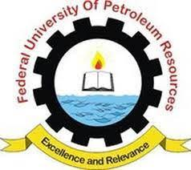

# Ant Colony Optimization for Gas-Oil Ratio Estimation

<p align="center">
    
</p>

## Project Overview

This project, developed by David, a final-year student at the Federal University of Petroleum Resources Effurun (FUPRE), utilizes an Ant Colony Optimization (ACO) algorithm to predict the Gas-Oil Ratio (GOR) based on PVT (Pressure-Volume-Temperature) data. By mimicking the foraging behavior of ants, the algorithm optimizes the estimation process, making it applicable to various challenges in petroleum engineering.

### Key Features

- **ACO Algorithm Implementation**: A robust algorithm that simulates ant behavior for optimal GOR estimation.
- **Interactive Streamlit Application**: Users can input parameters and visualize results in real-time.
- **Efficient Data Processing**: Handles various PVT properties, including pressure, API gravity, gas gravity, and reservoir temperature, ensuring accurate predictions.

### Access the Streamlit App

To access the Streamlit application, visit: [Streamlit App](https://aco-algorithm-for-solution-gas-oil-ratio.streamlit.app/)

### Usage

To run the application locally, ensure you have the required dependencies installed. Then execute the following command in your terminal:

```bash
streamlit run app.py
